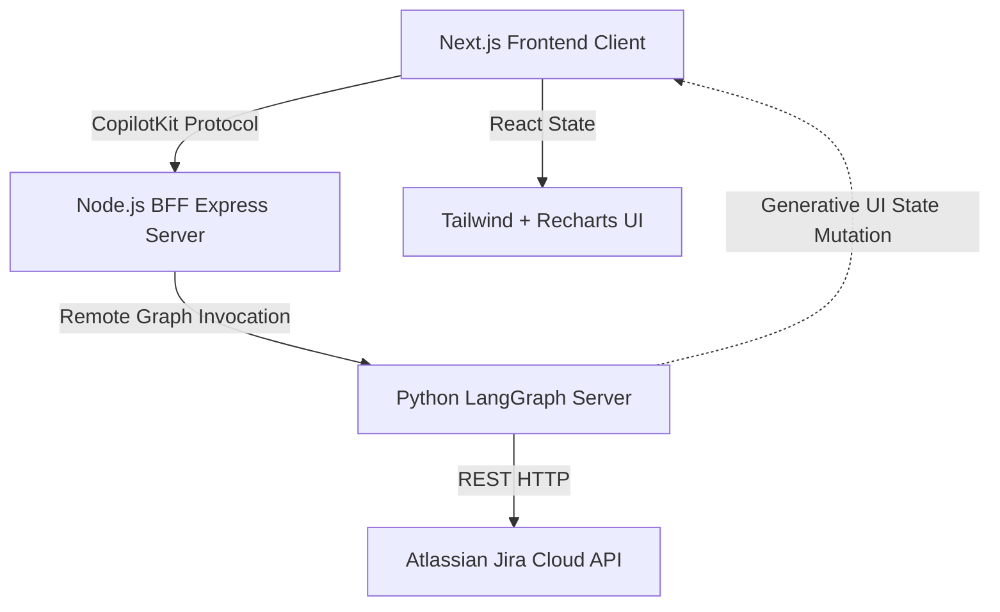
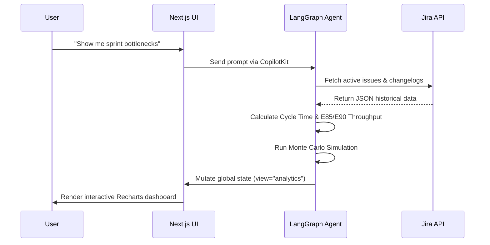

# PmAgent - Team Pulse


**PmAgent - Team Pulse** is an AI-powered project coordination dashboard designed for Agile/Kanban teams. It bridges the gap between raw issue-tracking data (Jira) and actionable, flow-based project management. Powered by a [LangGraph Deep Agent](https://docs.langchain.com/oss/python/deepagents/overview), it leverages **Actionable Agile** metrics (as defined by Daniel Vacanti) and Kanban University principles to provide real-time sprint health, throughput forecasting, and blocker detection.

## Core Features

- **Instant Jira Hydration:** Connects directly to your Jira SCRUM/Kanban projects to fetch real-time issue states. No manual exports required.
- **Agent-Driven Flow Analytics:** The integrated LangGraph agent autonomously calculates and renders:
  - **Cycle Time Scatterplots:** Spot aging work items instantly.
  - **Daily Throughput Tracking:** With 85th and 90th percentile confidence markers (E85/E90).
  - **Monte Carlo Simulations:** Predictive forecasting (P50, P85, P95) for remaining sprint backlog.
- **Actionable Agile Insights:** The "Como Van?" assistant proactively identifies blockers, aging tickets, and WIP limit violations, suggesting remedies based on Little's Law.
- **Persistent Threads:** Backed by CopilotKit Intelligence, conversations survive reloads and session drops.

---

## Architecture Stack



### Backend / Intelligence
- **LangGraph Deep Agents (Python):** Orchestrates the data fetching, mathematical modeling (Monte Carlo, percentiles), and state mutation.
- **Gemini 3.1 Flash-Lite:** The cognitive engine driving the agent's analysis and natural language generation.
- **Atlassian REST API:** Direct data ingestion pipeline for Jira issues and changelogs.

### Frontend
- **Next.js (App Router):** Fast, server-rendered React application.
- **CopilotKit:** Bridges the LangGraph backend to the React frontend, handling state synchronization, tool-call streaming, and UI component rendering (`<AnalyticsDashboard />`).
- **Recharts & TailwindCSS:** Used to build the expansive, data-dense "Team Analytics & Flow Metrics" view in the main canvas.

### Flow Analytics Execution



---

## Stack

### CopilotKit

CopilotKit connects your app's logic, state, and user context to the AI agents that deliver the animated and interactive part of your app experience — across both embedded UIs and fully headless interfaces. The kit ships with **CopilotKit Intelligence** wired in, giving you durable conversation threads (Postgres-backed), a runtime that bridges your frontend to any LangGraph agent, and built-in support for generative UI and MCP App composition.

[More about CopilotKit ->](https://docs.copilotkit.ai)

### LangChain Deep Agents

LangChain Deep Agents is a Python framework that gives an LLM agent built-in planning, sub-agent dispatch, a virtual filesystem, and a TODO loop — the patterns popularized by Claude Code and Manus, packaged as a `create_deep_agent(...)` call on top of LangGraph. The kit uses Deep Agents as the brain behind the canvas: a single prompt like "import the workshop leads and draft outreach to the top 5" triggers a multi-step plan that the agent executes tool-by-tool while you watch the cards appear.

[More about Deep Agents ->](https://github.com/langchain-ai/deepagents)

### Gemini

Gemini 3.1 Flash-Lite is Google's high-volume workhorse in the Gemini 3 family — fast, cheap, and tool-calling-capable. The kit defaults to **`gemini-3.1-flash-lite`** for chat — pick up an API key from [Google AI Studio](https://aistudio.google.com), drop it into `.env`, and you're done. Need a more reasoning-heavy model? Swap to **Gemini 3 Pro Preview** or **Gemini 3 Flash** with a one-line edit in `apps/agent/src/runtime.py` (`_gemini_llm`). Swapping to OpenAI, Anthropic, or any other LangChain-supported model is also a one-line edit (see [Switching to a different model](dev-docs/model-switching.md)).

[More about Gemini ->](https://ai.google.dev/gemini-api/docs)

### A2UI

[A2UI](https://a2ui.org/) is a protocol for agent-driven interfaces — it lets AI agents generate rich, interactive UI that renders natively across web, mobile, and desktop **without executing arbitrary code**. That sandboxed-by-default model pairs well with the kit's generative UI surface: Gemini emits A2UI components, the renderer paints them, and the agent never ships executable code to the client. Browse the [custom catalog](https://a2ui-composer.ag-ui.com/custom-catalog) for component examples.

[More about A2UI ->](https://github.com/google/A2UI)

### Notion MCP (via mcp-use)

The kit ships with a **Notion Leads database demo** wired through the official [Notion MCP server](https://github.com/makenotion/notion-mcp-server) (`@notionhq/notion-mcp-server`), called from Python via [mcp-use](https://manufact.com/mcp-use). MCP is the open protocol for connecting LLMs to tools — Anthropic publishes it, and Notion ships a first-party server. Swap to any other MCP server (Linear, Slack, GitHub, Google Drive, …) by changing one config dict in `apps/agent/src/notion_mcp.py` and updating the prompt's `INTEGRATION_PROMPT`.

[More about MCP ->](https://modelcontextprotocol.io)

### Manufact / mcp-use

The kit's `apps/mcp/` package is an MCP server built with [`mcp-use`](https://manufact.com/mcp-use), an open-source TypeScript framework for building MCP servers and MCP Apps. `npm run dev:mcp` gives you a full development environment with a local Inspector and support for hot reload for quick iteration. Easily deploy the server to Manufact Cloud with `npm run -w mcp deploy`.

[More about Manufact ->](https://manufact.com)

### Daytona

[Daytona](https://www.daytona.io/) is a secure and elastic infrastructure runtime for AI-generated code execution and agent workflows. Sandboxes spin up in under 90ms with full isolation — dedicated kernel, filesystem, network stack, and allocated vCPU/RAM/disk — and run any Python, TypeScript, or JavaScript code. Built on OCI/Docker compatibility with stateful environment snapshots, it's a natural fit when an agent in this kit needs to execute generated code or persist a workspace across sessions. Agents and developers interact with sandboxes programmatically through Daytona's SDKs, API, and CLI.

[More about Daytona ->](https://github.com/daytonaio/daytona)

---

## Run it locally

1. Run `npx @copilotkit/cli@latest init` and select **Intelligence** when prompted.
2. Drop a Gemini API key into **both** `.env` and `apps/agent/.env`. 
3. Follow the [Jira Setup](#jira-setup) below for the Atlassian credentials.
4. Run `npm install` then `npm run dev:no-docker`.

> `npm run dev:no-docker` boots the Next.js UI, the Node.js BFF, and the Python LangGraph server simultaneously. 

Please give us feedback on your experience with it!

### Jira Setup

PmAgent connects directly to Jira via its REST API (no complex MCP configuration required). Auth is done via a standard Atlassian API Token.

**1. Generate an Atlassian API Token**
1. Go to your [Atlassian Account Security](https://id.atlassian.com/manage-profile/security/api-tokens) page.
2. Click **Create API token**, name it (e.g. "PmAgent"), and copy the token.

**2. Configure the Environment**
Open `apps/agent/.env` (and `.env` at the root) and set your credentials:

```bash
JIRA_URL="https://your-domain.atlassian.net"
JIRA_EMAIL="your.email@example.com"
JIRA_API_TOKEN="<paste the API token here>"
```

**3. Start the Project**
```bash
npm run dev:no-docker
```
On boot, the LangGraph agent will automatically fetch the latest 30 active/completed issues from the `SCRUM` project and render the analytics dashboard instantly.

---

## Vibe coding

The kit ships with skills pre-installed for Cursor, Claude Code, and any agent reading `.agent/`. Open the project in your coding tool and they're picked up automatically — no extra setup. They teach your coding agent CopilotKit's v2 API surface, MCP server / MCP App authoring patterns, and this kit's own conventions.

```
.
├── .agent/skills/   ← agent-tool-agnostic (read by any agent following the AGENTS.md convention)
├── .claude/skills/  ← Claude Code
└── .cursor/skills/  ← Cursor
```

Each directory carries the same set of 11 skills:

- **CopilotKit (8):** `copilotkit-{setup, develop, integrations, debug, upgrade, contribute, agui, self-update}` — from [CopilotKit/skills](https://github.com/CopilotKit/skills).
- **MCP (3):** `mcp-builder`, `mcp-apps-builder`, `chatgpt-app-builder` — from the Manufact reference. They cover authoring an MCP server (the open protocol Anthropic publishes for wiring LLMs to external tools — the same protocol the kit's Notion integration uses) and packaging it as an MCP App that runs natively in Claude or ChatGPT.

To **update** the CopilotKit skills to the latest upstream:

```bash
npx skills add copilotkit/skills --full-depth -y
```

### Connect to the CopilotKit docs MCP server

CopilotKit also exposes a hosted MCP server that gives your coding agent live access to the latest CopilotKit reference material — handy when the checked-in skills lag upstream or you want to ask the docs questions interactively.

**MCP endpoint:** `https://mcp.copilotkit.ai/mcp`

**Claude Web** (Anthropic's web app — attaches MCP servers via Connectors):

1. Open [Claude](https://claude.ai/), click your user in the bottom-left of the chat box, and select **Settings**.
2. In the left-hand menu, select **Connectors** (or jump straight to the [Connectors settings page](https://claude.ai/settings/connectors)).
3. Click **Add custom connector**.
4. **Name:** `CopilotKit`
5. **URL:** `https://mcp.copilotkit.ai/mcp`
6. Click **Add**.

Setup for Claude Code, Cursor, ChatGPT, and other coding agents is documented at [docs.copilotkit.ai/coding-agents](https://docs.copilotkit.ai/coding-agents).

Reference docs: [CopilotKit Coding Agents](https://docs.copilotkit.ai/coding-agents) · [CopilotKit Skills repo](https://github.com/CopilotKit/skills) · [Agent Skills standard](https://agentskills.io).

---

## Documentation

Deeper guides live in [`dev-docs/`](dev-docs/):

- [Setup](dev-docs/setup.md) · [Model switching](dev-docs/model-switching.md) · [MCP server](dev-docs/mcp-server.md)
- [Architecture](dev-docs/architecture.md) · [Customization](dev-docs/customization.md) · [Threads / Intelligence](dev-docs/threads.md)
- [Scripts](dev-docs/scripts.md) · [Demo prompts](dev-docs/demo-prompts.md) · [Troubleshooting](dev-docs/troubleshooting.md)

## License

MIT.

---

> Built for the Generative UI Global Hackathon: Agentic Interfaces.
