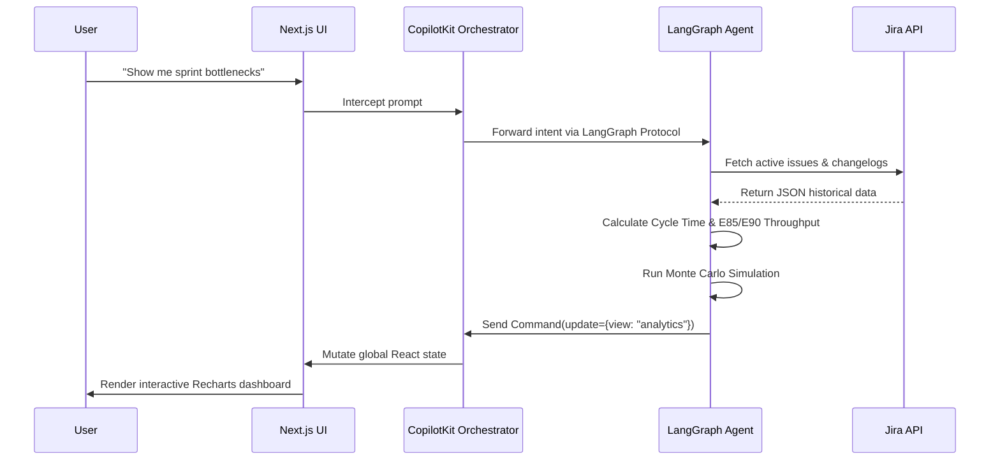

# PmAgent - Team Pulse


**PmAgent - Team Pulse** is an AI-powered project coordination dashboard designed for Agile/Kanban teams. It bridges the gap between raw issue-tracking data (Jira) and actionable, flow-based project management. Powered by a [LangGraph Deep Agent](https://docs.langchain.com/oss/python/deepagents/overview), it leverages **Actionable Agile** metrics (as defined by Daniel Vacanti) and Kanban University principles to provide real-time sprint health, throughput forecasting, and blocker detection.

## 🚀 Core Features

- **Instant Jira Hydration:** Connects directly to your Jira SCRUM/Kanban projects to fetch real-time issue states. No manual CSV exports required.
- **Agent-Driven Flow Analytics:** The integrated LangGraph agent autonomously calculates and renders:
  - **Cycle Time Scatterplots:** Spot aging work items instantly.
  - **Daily Throughput Tracking:** With 85th and 90th percentile confidence markers (E85/E90).
  - **Monte Carlo Simulations:** Predictive forecasting (P50, P85, P95) for the remaining sprint backlog.
- **Actionable Agile Insights:** The "Como Van?" assistant proactively identifies blockers, aging tickets, and WIP limit violations, suggesting remedies based on Little's Law.
- **Persistent Threads:** Backed by CopilotKit Intelligence, conversations survive reloads and session drops.

---

## 🧠 Architecture Stack

The architecture is built heavily on the principles of **Generative UI**, where the AI doesn't just return text, but dynamically dictates the React component layout on the client.

### Generative UI Orchestration

```mermaid
graph TD
    User((User)) -->|Prompt / Action| UI[Next.js Frontend]
    UI -->|React Context| CK[CopilotKit Orchestrator]
    
    CK -->|LangGraph Protocol| BFF[Node.js BFF Gateway]
    BFF -->|Remote Graph Invocation| Agent[Python LangGraph Deep Agent]
    
    Agent <-->|REST API (Issues & Changelogs)| Jira[Atlassian Jira Cloud]
    
    Agent -->|State Mutation (Command)| BFF
    BFF -->|State Sync| CK
    
    CK -->|Generates UI Dynamically| Canvas{Main View Canvas}
    Canvas -->|view="board"| PB[PipelineBoard Component]
    Canvas -->|view="analytics"| AD[AnalyticsDashboard Component]
```

### Flow Analytics Execution



---

## 🛠️ Run it locally

### 1. Initial Setup
Run the following commands to install dependencies:
```bash
npx @copilotkit/cli@latest init
# Select "Intelligence" when prompted
npm install
```

### 2. Environment Variables
Drop a Gemini API key into **both** `.env` and `apps/agent/.env`. 

PmAgent connects directly to Jira via its REST API. Auth is done via a standard Atlassian API Token.

1. Go to your [Atlassian Account Security](https://id.atlassian.com/manage-profile/security/api-tokens) page.
2. Click **Create API token**, name it (e.g. "PmAgent"), and copy the token.
3. Open `apps/agent/.env` (and `.env` at the root) and set your credentials:

```bash
JIRA_URL="https://your-domain.atlassian.net"
JIRA_EMAIL="your.email@example.com"
JIRA_API_TOKEN="<paste the API token here>"
```

### 3. Start the Project
```bash
npm run dev:no-docker
```
> `npm run dev:no-docker` boots the Next.js UI, the Node.js BFF, and the Python LangGraph server simultaneously. 

On boot, the LangGraph agent will automatically fetch the latest active/completed issues from the `SCRUM` project and render the analytics dashboard instantly.

---

## 📚 Spec-Driven Development (SDD)

This project follows the strict **GitHub Spec Kit** methodology. All architectural decisions, data models, and agent behaviors are heavily documented.

See the [`specs/`](./specs) directory for:
- `00-constitution.md`
- `01-specify.md`
- `02-plan.md`
- `03-task.md`

## License

MIT. Built for the Generative UI Global Hackathon: Agentic Interfaces.
