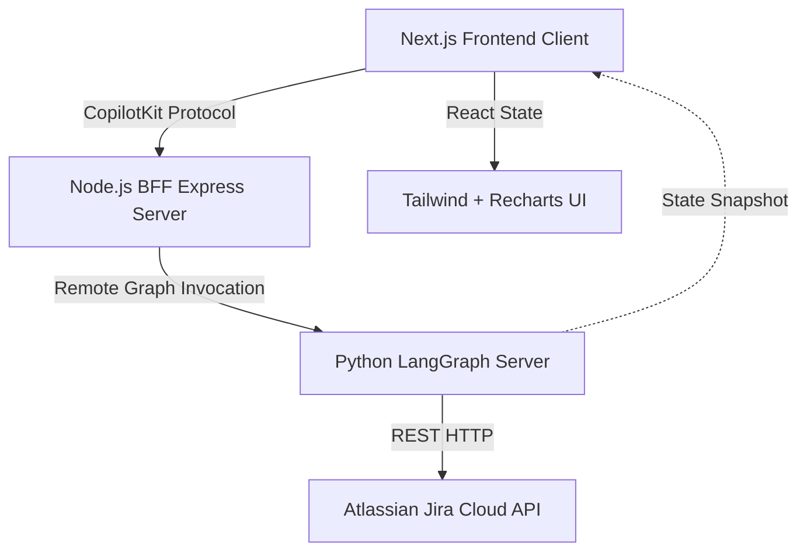

# System Architecture Specification

## 1. High-Level Architecture

The **PmAgent - Team Pulse** application follows a three-tier architecture specifically optimized for Generative UI and stateful agent interactions.

## 2. Component Specifications

### 2.1. Frontend (Next.js App Router)
*   **Role:** Renders the user interface, manages local React state, and hosts the CopilotKit chat provider.
*   **Key Libraries:** `React 18`, `TailwindCSS` (styling), `Recharts` (data visualization), `@copilotkit/react-core` (agent communication).
*   **State Management:** Utilizes a global `AgentState` object synced bidirectionally with the backend via CopilotKit.
*   **Dynamic Rendering:** The main `<main>` container dynamically switches between `<PipelineBoard />` and `<AnalyticsDashboard />` based on the `state.view` property dictated by the agent.

### 2.2. Backend-For-Frontend (BFF)
*   **Role:** Acts as a secure proxy and WebSocket gateway between the browser and the Python LangGraph runtime.
*   **Technology:** `Node.js`, `Express`, `@copilotkit/backend`.
*   **Security:** Hides internal API keys (OpenAI/Gemini) and the direct LangGraph deployment URL from the client.

### 2.3. Agent Runtime (Python LangGraph)
*   **Role:** The cognitive engine. Executes multi-step plans, parses natural language, interacts with external APIs (Jira), and mutates the frontend state.
*   **Technology:** `Python 3.12+`, `LangGraph`, `LangChain`, `google-genai`.
*   **State Graph:** A cyclical graph where the `Agent` node determines tool execution, and the `Tools` node executes Python functions (e.g., `generate_sprint_analytics`).
*   **LLM:** Gemini 3.1 Flash-Lite (configured via `runtime.py`).

### 2.4. External Systems
*   **Jira Cloud:** Source of truth for all issue data, status transitions (changelogs), and project scopes. Connected via Basic Auth (Email + API Token) interacting with the `/rest/api/3/` endpoints.
